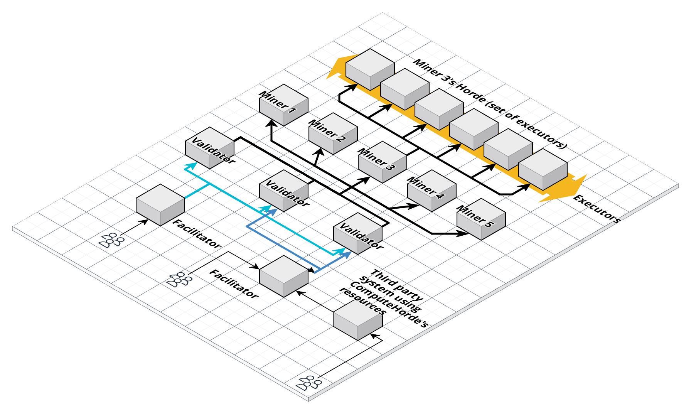

# What is this

This repository contains reference implementations of

1. Validator
2. Miner
3. Executor

of the ComputeHorde BitTensor SubNet. Running etc. is explained in each component's README.

# ComputeHorde



Data flow looks like this:

1. **Facilitator** is an internet facing app charging users for accepting jobs from them, which are then passed on to validators.
1. **Validator** has the same meaning as in other Bittensor subnets. It receives organic requests (requests from end users) or generates synthetic ones itself, sends them to miners and reads the results. Results for organic traffic are then passed back to end users, while synthetic traffic is used to adjust miners' scores.
[See validator's README for more details](validator/README.md)
1. **Miner** has the same meaning as in other Bittensor subnets. It receives job requests from validators, spawns executors to do the actual work and sends the results back to validators.
[See miner's README for more details](miner/README.md)
1. **Executor** is a virtual machine managed by a single miner, spawned to perform a single dockerized job, and is scrapped afterwards. Its access to the network is limited to necessary bits needed to execute a job, i.e. communicate with a miner, download the docker image that runs the job, download the docker image containing executor app, and mount the job data volume. Executors have hardware classes assigned and together form the horde of a miner.
[See executor's README for more details](executor/README.md)

# Scoring

Currently miners are rewarded for providing the time of networkless GPU-equipped servers, proportionally to their efficiency. Each miner can (for now) provide only their fastest Executor.

In February 2024 this will change - subnet will define more resource types andValidators will reward miners more for providing resources that are in higher demand. The system will quickly fill to capacity with organic traffic.

# Running

To quickly start a validator or miner, create an ubuntu server and execute the following command from your local machine (where you have your wallet files).

**Validator:**
```shell
curl -sSfL https://github.com/backend-developers-ltd/ComputeHorde/raw/master/install_validator.sh | bash -s - SSH_DESTINATION HOTKEY_PATH
```

**Miner:**
```shell
curl -sSfL https://github.com/backend-developers-ltd/ComputeHorde/raw/master/install_miner.sh | bash -s - SSH_DESTINATION HOTKEY_PATH
```

Replace `SSH_DESTINATION` with your server's connection info (i.e. `username@1.2.3.4`)
and `HOTKEY_PATH` with the path of your hotkey (i.e. `~/.bittensor/wallets/my-wallet/hotkeys/my-hotkey`).
This script installs necessary tools in the server, copies the keys and starts the validator/miner with the corresponding runner and default config.

If you want to change the default config, see [Validator runner README](validator/envs/runner/README.md) and [Miner runner README](miner/envs/runner/README.md) for details.
